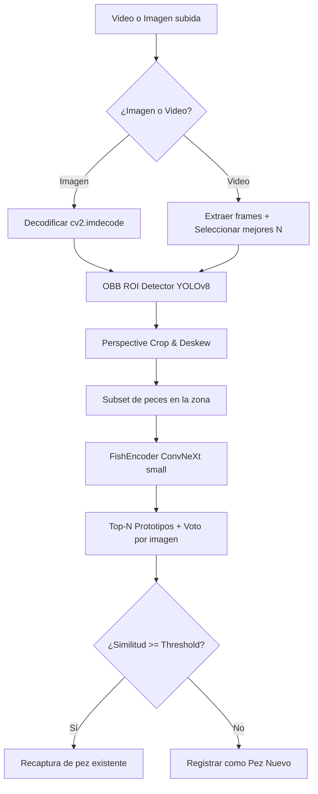

# FishDex ReID Pipeline Documentation

Este documento detalla el nuevo pipeline de re-identificación de peces implementado en la v3 del backend de FishDex.

---

## 1. Arquitectura del Pipeline

El flujo de procesamiento online es el siguiente:



1. **Bifurcación Imagen/Video:** Identifica el tipo de entrada mediante `content_type` y la extensión del archivo. Las imágenes se decodifican directamente (1 frame). En videos, se extraen frames clave.
2. **YOLO OBB Detector (`obb_best.pt`):** Localiza el pez con una caja orientada (OBB) en cada frame.
3. **Deskew / Rectificación:** Se aplica una transformación de perspectiva homográfica para enderezar el cuerpo del pez (ROI rectificado).
4. **Subconjunto de búsqueda:** Se filtran los peces de la misma especie dentro del área o zonas adyacentes.
5. **Carga y Caché de Embeddings:**
   * Para cada pez candidato, el sistema busca archivos `.npy` precalculados en disco (`{reid_cache_name}_embeddings.npy`).
   * Si no existen, extrae los embeddings (512-d) de las imágenes soporte y guarda la caché.
   * Agrupa los embeddings de todos los avistamientos (`image_dirs`) para formar un prototipo rico.
6. **Matching Top-N y Voto:** Cada frame de consulta vota por el prototipo más cercano (similitud coseno). Los empates se resuelven mediante la media de similitud.
7. **Decisión:** Si el score promedio del ganador es `>= similarity_threshold` se considera recaptura; de lo contrario, se crea un pez nuevo.

---

## 2. Parámetros de Configuración (`.env`)

```env
# ── OBB ROI Detector ────────────────────────────────────────────────────────
FISHDEX_OBB_MODEL_PATH=models/detector/obb_best.pt
FISHDEX_OBB_CONF_THRESHOLD=0.20
FISHDEX_ROI_REQUIRE_SINGLE_DETECTION=true
FISHDEX_ROI_ALLOW_CENTER_FALLBACK=false

# ── Fish ReID Model (FishEncoder ConvNeXt small) ────────────────────────────
FISHDEX_REID_MODEL_PATH=models/reid/reid_best.pt
FISHDEX_REID_MODEL_NAME=convnext_small.fb_in22k_ft_in1k
FISHDEX_REID_EMBEDDING_DIM=512
FISHDEX_REID_IMG_SIZE=128
FISHDEX_REID_BATCH_SIZE=64
FISHDEX_REID_NUM_WORKERS=0
FISHDEX_REID_MAX_SUPPORT_IMAGES_PER_IDENTITY=5
FISHDEX_REID_MAX_QUERY_IMAGES_FOR_VOTE=5
FISHDEX_REID_SIMILARITY_THRESHOLD=0.75
FISHDEX_REID_CACHE_NAME=fishencoder_convnext_small_512_128

# ── Dispositivo de ejecución ────────────────────────────────────────────────
FISHDEX_DEVICE=cpu # O 'cuda' para aceleración por GPU
```

---

## 3. Calibración del Threshold

El threshold por defecto es **`0.75`**. Esta es una configuración conservadora adecuada para producción:
* **Duplicar es mejor que Falsas Recapturas:** En re-identificación de fauna, una falsa recaptura contamina el historial y los datos científicos del pez. Es preferible generar un registro duplicado (que puede corregirse manualmente por un administrador) a asignar una captura al pez incorrecto.
* **Calibración práctica:**
  * **Si el sistema genera demasiados peces nuevos** (recapturas reales fallidas obtienen similitudes de, por ejemplo, `0.72`): Se puede reducir a `0.70`.
  * **Si el sistema genera falsas recapturas** (peces distintos obtienen similitud superior a `0.75`): Se debe incrementar a `0.80`.

---

## 4. Pruebas Rápidas con `curl`

### Health Check Detallado
Muestra si los modelos están configurados y si ya han sido cargados en memoria (la carga se realiza en lazy mode en la primera llamada de identificación):
```powershell
curl.exe http://localhost:8000/api/v1/health/detailed
```

### Enviar Identificación
```powershell
curl.exe -X POST "http://localhost:8000/api/v1/identify" `
  -F "video=@C:/ruta/a/pez.jpg;type=image/jpeg" `
  -F "area_code=401 001" `
  -F "species=Common carp" `
  -F "user_role=researcher"
```

---

## 5. Archivos Generados por Catch

Por cada catch registrado en `data/`, se almacenan:
* `frame_X.jpg`: Los ROIs extraídos y rectificados del pez.
* `fishencoder_convnext_small_512_128_embeddings.npy`: Matriz `(N, 512)` de embeddings individuales de cada frame.
* `fishencoder_convnext_small_512_128_prototype.npy`: Vector `(512,)` promedio de embeddings de ese catch (guardado como caché rápido).
* El archivo obsoleto `embeddings.npy` de ResNet **ya no se genera**.
